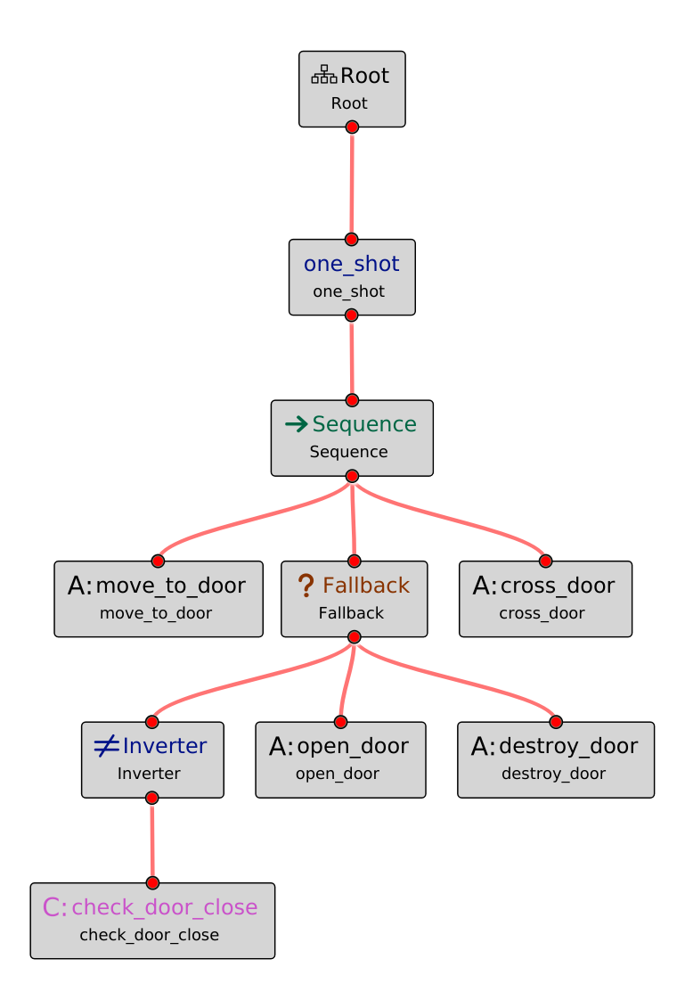
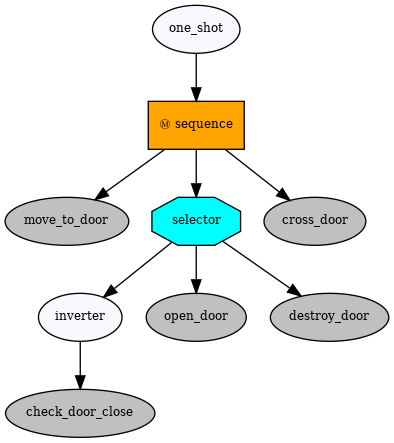

[](https://github.com/cardboardcode/py_trees_meet_groot/actions/workflows/ci.yml)

## **Quickstart** :rocket:

```bash
pip install git+https://github.com/cardboardcode/py_trees_meet_groot@v0.0.1a
```

# **Import Groot XML files into py_trees**

[Groot2](https://github.com/BehaviorTree/Groot2) is a Graphical Editor, written in C++ and Qt, to create BehaviorTrees. It is only compatible with [BehaviorTree.CPP](https://github.com/BehaviorTree/BehaviorTree.CPP). This module is an attempt to use Groot to generate trees using [py_trees](https://github.com/splintered-reality/py_trees) instead of BehaviorTree.CPP.

The main purpose of this module is to load an XML file generated with Groot and transform it into a valid `py_trees` behavior tree. 

> [!WARNING]
> Execution of `py_trees` behavior trees is not connected to Groot for the moment.

<table>
    <tr>
        <td></td>
        <td></td>
    </tr>
    <tr>
        <td><p align="center">Groot Behavior Tree</p></td>
        <td><p align="center">py_trees Behavior Tree</p></td>
    </tr>
</table>

## **Verified Compatibilities**
- **py_trees** `2.4.0` 
- **Groot2** `1.8.1`
- **BT.CPP** `4.8`

## **Groot Supported Features**

BehaviorTree.CPP and py_trees use different control sequences, decorators and tree leaves. This section explains the mapping between one and the other in order to use Groot in py_trees.

### **Control Nodes to Composite Nodes**

| Groot | py_trees |
|-------|----------|
| AsyncFallback | Not Available ❌ |
| AsyncSequence | Not Available ❌ |
| Fallback | Selector with `memory=True` |
| IfThenElse | Not Available ❌ |
| Parallel with `success_threshold=1` | Parallel with `policy=SuccessOnOne` |
| Parallel with `success_threshold <> 1` | Parallel with `policy=SuccessOnAll` |
| ParallelAll | Not Available ❌ |
| ReactiveFallback | Selector with `memory=False` |
| ReactiveSequence | Sequence with `memory=False` |
| Sequence | Sequence with `memory=True` |
| SequenceWithMemory | Sequence with `memory=True` |
| SwitchX | Not Available ❌ |
| WhileDoElse | Not Available ❌ |


### **Decorators to Decorators**

| Groot | py_trees |
|-------|----------|
| Delay | Sequence + Timer |
| ForceFailure | SuccessIsFailure |
| ForceSuccess | FailureIsSuccess |
| Inverter | Inverter | 
| KeepRunningUntilFailure | SuccessIsRunning |
| LoopDouble | Not Available ❌ |
| LoopString | Not Available ❌ |
| Precondition | Not Available ❌ |
| Repeat | Retry |
| RetryUntilSuccessful | FailureIsRunning |
| Timeout | Timeout |
| RunOnce | Not Available ❌ |
| User defined Decorator | Decorator in `decorators` |

Additional py_trees decorators, both core defined as `OneShot`, `StatusToBlackboard`, `FailureIsRunning`, `RunningIsSuccess`... or newly created by the user, must be added in the `decorators` dictionary and pass to the `load` function to be used.


### **Actions & Conditions to Behaviors**

| Groot | py_trees |
|-------|----------|
| AlwaysFailure | Failure |
| AlwaysSuccess | Success |
| Script | Not Available ❌  |
| SetBlackBoard | SetBlackboardVariable `output_key=value` |
| Sleep | Timer  |
| ScriptCondition | Not Available ❌  |
| user defined Action | Behavior in `user_behaviors` |
| user defined Condition | Behavior in `user_behaviors` |


All manually defined Actions and Conditions in Groot have to be defined as py_trees `behaviors` and added into the `behaviors` list in function `load` to be used.

## **Unsupported Elements**

The following elements are unsupported right now:

* Connecting the execution of py_trees to `Groot2`

## **Examples**
  
Please refer to [examples](https://github.com/cardboardcode/py_trees_meet_groot/tree/devel/examples) directory.

## **Build From Source** :hammer:

1. **Download** the repository:
    ```bash
    git clone https://github.com/cardboardcode/py_trees_meet_groot.git --single-branch --depth 1 --branch devel && cd py_trees_meet_groot
    ```

2. **Create** a `python3` virtual environment:
    ```bash
    python3 -m venv venv
    source venv/bin/activate
    ```

3. **Install** the package in development mode (this installs `py_trees` as a dependency):
   ```bash
   pip install -e .
   ```

> [!WARNING]  
> Do not use `pip install py_trees_meet_groot` since this implementation is not yet aligned with what is published on pip.

## **Verify** :heavy_check_mark:

**Verify the installation** by running a simple test:

```bash
python -c "import py_trees_meet_groot; print('Successfully imported  py_trees_meet_groot')"
```

You should see the following terminal output:

```bash
Successfully imported py_trees_meet_groot
```